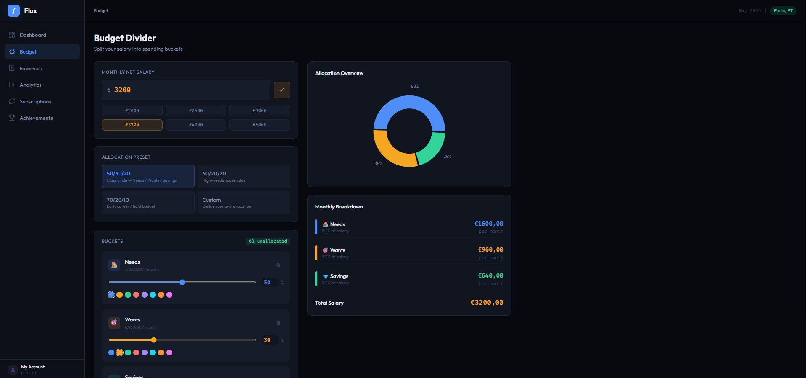
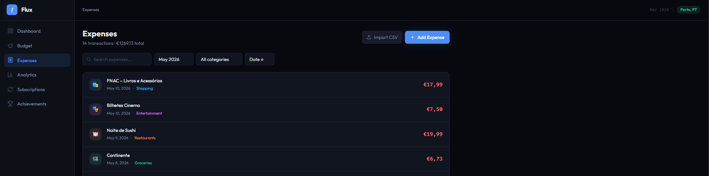
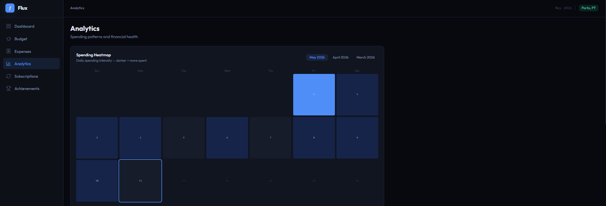
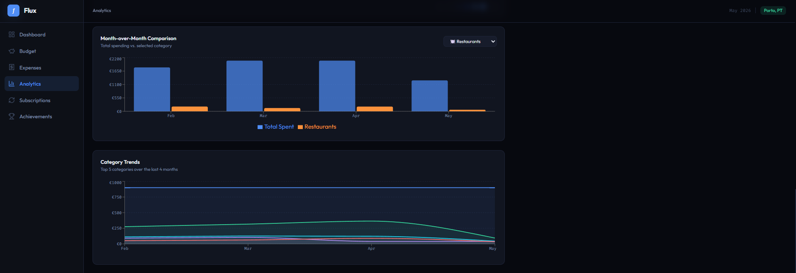
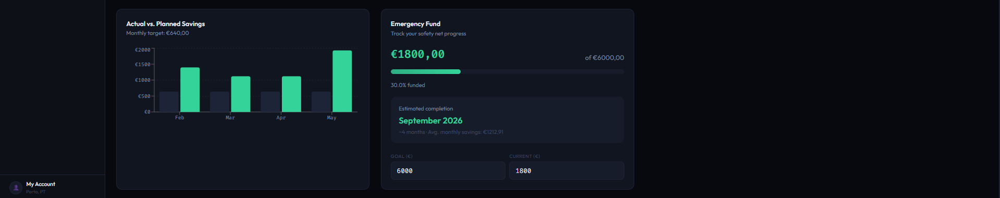
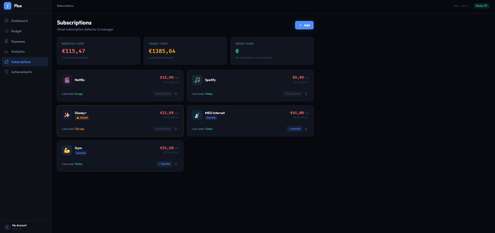
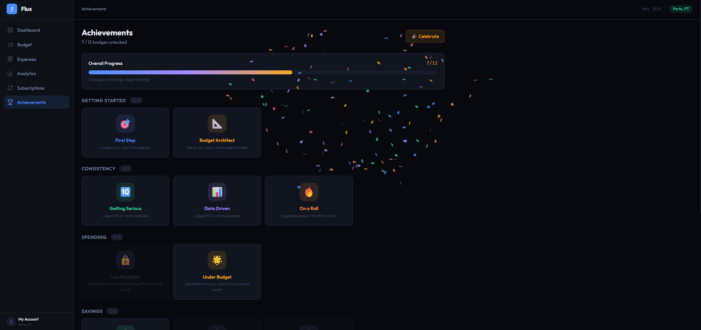

# Flux - Personal Expense Tracker

A modern, feature-rich personal finance tracker built with React, Vite and Tailwind CSS. Track expenses, split your salary into smart budget buckets, analyse spending patterns and stay on top of your financial health. All stored locally in your browser.

---

## Features

### 💰 Budget Divider
Split your monthly salary into customisable spending buckets with visual feedback.
- One-click presets: **50/30/20**, **60/20/20**, **70/20/10**
- Create, rename, reorder, and delete custom buckets
- Per-bucket colour picker and percentage/slider controls
- Live pie chart showing allocation at a glance
- Monthly amount breakdown per bucket



### 💸 Expense Management
Full CRUD for your transactions with smart filtering.
- Add, edit, and delete expenses with category, date, and recurring flag
- Filter by month, category, and free-text search
- Sort by date or amount (ascending/descending)
- Recurring expense tagging (rent, subscriptions, etc.)
- **CSV Import** - upload a bank statement and expenses are auto-categorised based on merchant name (supports Portuguese retailers: Continente, Pingo Doce, Lidl, MEO, and more)



### 📊 Analytics
Go beyond totals - understand your spending behaviour.
- **Spending Heatmap** - calendar view where colour intensity reflects daily spend; spot impulse-buying patterns at a glance
- **Month-over-Month Comparison** - bar chart comparing total spend and any selected category across the last 4 months
- **Category Trends** - stacked area chart showing how your top 5 categories evolve over time
- **Actual vs. Planned Savings** - side-by-side comparison of your savings target versus what you actually kept
- **Emergency Fund Projection** - set a savings goal and see an estimated completion date based on your recent average savings rate





### 🔄 Subscriptions
Detect and manage recurring payments before they drain your budget.
- Dashboard of all subscriptions with monthly and yearly cost totals
- **Ghost Subscription Detector** - flags any subscription unused for 21+ days
- Warning state for subscriptions unused between 10–21 days
- Essential toggle to exclude must-haves from ghost alerts
- Estimated annual savings from cancelling ghost subscriptions



### 🏆 Achievements
Gamified milestones to keep you motivated.
- 12 badges across 5 categories: Getting Started, Consistency, Spending, Savings, and Features
- Badges auto-unlock based on real activity (expenses logged, savings milestones, staying under budget)
- Progress bar showing overall completion
- Confetti celebration button 🎉




## Getting Started

### Prerequisites
- Node.js 18 or higher
- npm 9 or higher

### Installation

```bash
# 1. Unzip and enter the project
unzip Flux-ExpenseTracker-master.zip

# 2. Install dependencies
npm install

# 3. Start the dev server
npm run dev
```

Then open [http://localhost:5173](http://localhost:5173) in your browser.

### Other commands

```bash
npm run build     # Production build -> dist/
npm run preview   # Preview the production build locally
```

---

## Project Structure

```
expense-tracker/
├── index.html
├── package.json
├── vite.config.js
├── tailwind.config.js
├── postcss.config.js
└── src/
    ├── main.jsx              # React entry point
    ├── App.jsx               # Root layout + page routing
    ├── index.css             # Global styles & Recharts overrides
    ├── components/
    │   ├── Sidebar.jsx       # Navigation sidebar
    │   └── Modal.jsx         # Reusable modal wrapper
    ├── pages/
    │   ├── Dashboard.jsx     # Overview: stats, heatmap, pie, recent transactions
    │   ├── BudgetDivider.jsx # Salary splitting with presets and custom buckets
    │   ├── Expenses.jsx      # Expense list, CRUD, CSV import
    │   ├── Analytics.jsx     # Heatmap, MoM chart, savings ratio, emergency fund
    │   ├── Subscriptions.jsx # Ghost subscription detector
    │   └── Achievements.jsx  # Gamification badges
    ├── store/
    │   └── useStore.js       # Zustand store with localStorage persistence + sample data
    └── utils/
        ├── categories.js     # Category definitions, colours, icons, bucket mapping
        └── csvImport.js      # CSV parsing + keyword-based auto-categorisation
```

---

## CSV Import Format

The importer accepts any CSV with columns named (case-insensitive):

| Column | Accepted names |
|---|---|
| Description | `Description`, `Descrição`, `Merchant`, `Name` |
| Amount | `Amount`, `Montante`, `Value` |
| Date | `Date`, `Data`, `Transaction Date` |

Amounts are automatically made positive (debits work fine). Dates support any format parseable by `new Date()` (ISO, US, EU).

**Auto-categorisation** works by matching the description against a keyword list. Recognised merchants include:

- 🛒 **Groceries** - Continente, Pingo Doce, Lidl, Aldi, Intermarché, Jumbo
- 📡 **Utilities** - MEO, NOS, Vodafone, EDP, Electricidade
- 🎬 **Subscriptions** - Netflix, Spotify, Disney+, HBO, Amazon Prime
- 🚌 **Transport** - Uber, Bolt, CP, Andante, Galp, BP
- 💊 **Health** - Farmácia, Clínica, Ginásio, Dentista
- 🏠 **Housing** - Renda, Arrendamento, Condomínio
- 🍽️ **Restaurants** - Restaurante, Tasca, Uber Eats, Glovo, McDonald's
- 🎭 **Entertainment** - Cinema, Teatro, Museu, FNAC, Steam
- 🛍️ **Shopping** - Zara, H&M, Decathlon, Amazon, Nike

Anything unrecognised is tagged as **Other** and can be re-categorised manually.

---

## Customisation

### Adding a new category
In `src/utils/categories.js`, add an entry to the `CATEGORIES` object:

```js
travel: {
  id: 'travel',
  label: 'Travel',
  icon: '✈️',
  color: '#38BDF8',
  bucket: 'wants',   // 'needs' | 'wants' | 'savings'
},
```

Then add matching keywords to the `KEYWORD_MAP` array to enable auto-categorisation on CSV import.

### Changing the currency symbol
Search for `€` in the codebase - it appears in the `fmt()` helper at the top of each page file. Replace with your preferred symbol.

### Changing sample data
Edit the `SAMPLE_EXPENSES` array at the top of `src/store/useStore.js`. The app is pre-loaded with 4 months of realistic Portuguese expenses (February–May 2026) so all charts have data to display on first run.

---

## Known Limitations

- **No backend** - data lives in the browser only; clearing site data in browser settings will erase it
- **Single user** - no accounts or sync between devices
- **No multi-currency** - amounts are treated as a single currency (€ by default)

---

## License

MIT - free to use, modify and distribute.